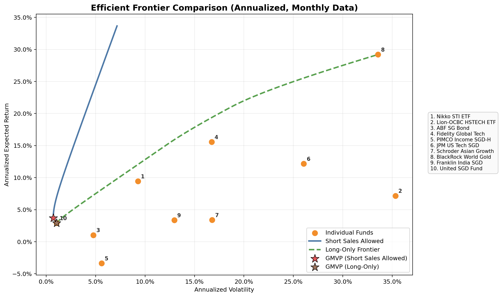
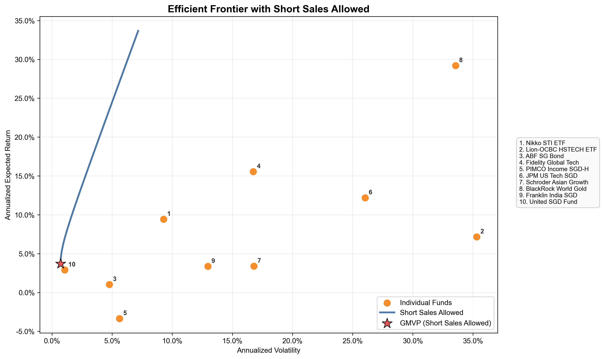
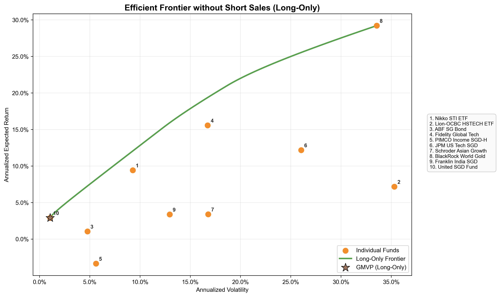
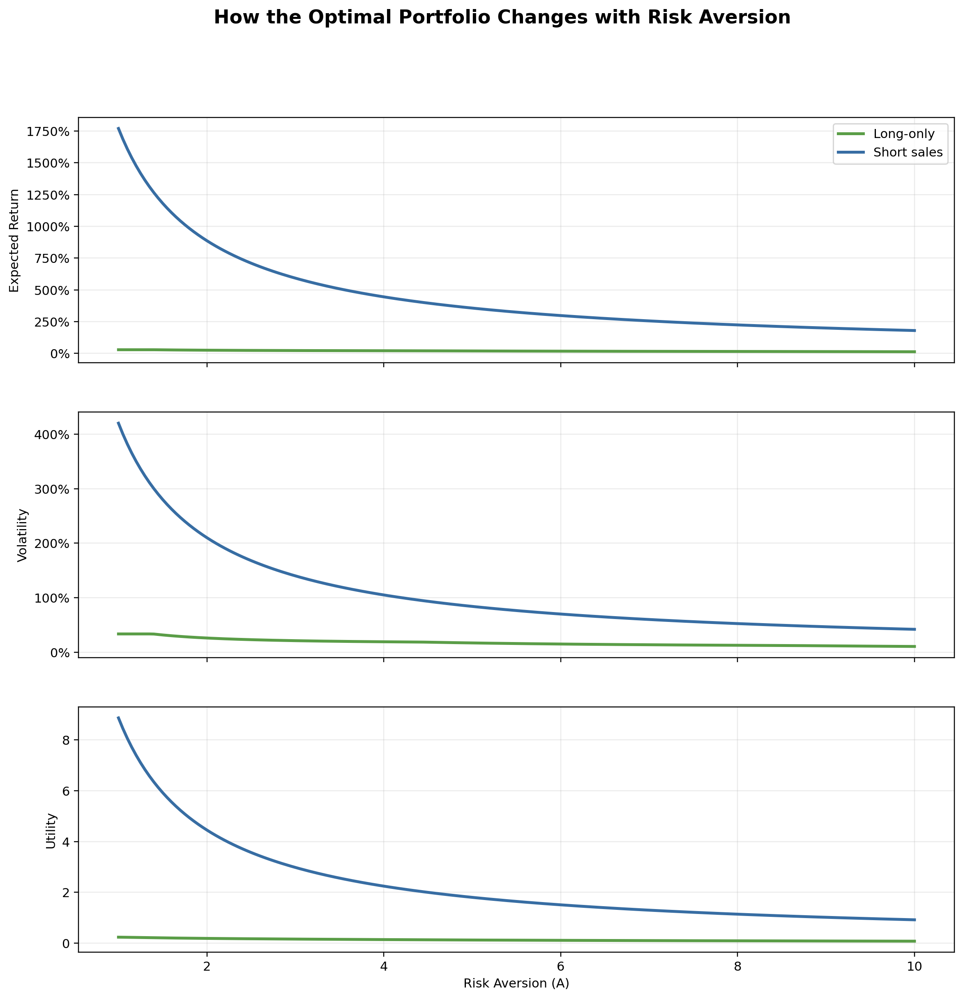
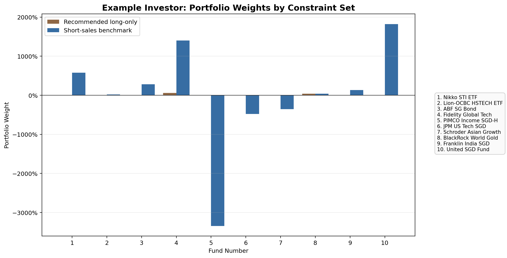

# BMD5302 Group Project

This repository contains our **Robot Adviser** project for **BMD5302**, developed as a full workflow from quantitative portfolio analysis to a client-facing digital platform.

The project is organized into three major parts:

- **Part 1: Efficient Frontier**
- **Part 2: Risk Aversion & Optimal Portfolio**
- **Part 3: Web Platform + AI Chatbot**

## Live Demo

GitHub Pages:

- [https://gengyuzhu.github.io/BMD5302-Group-Project/](https://gengyuzhu.github.io/BMD5302-Group-Project/)

GitHub Repository:

- [https://github.com/gengyuzhu/BMD5302-Group-Project](https://github.com/gengyuzhu/BMD5302-Group-Project)

## Project Overview

The objective of this project is to design a robo-advisory prototype that:

- analyzes a 10-fund investment universe
- constructs and visualizes the efficient frontier
- estimates investor risk aversion through a questionnaire
- recommends an optimal portfolio using a utility-maximization framework
- presents the result through a web interface and an AI-style chatbot

The same underlying dataset and optimization outputs are reused across all three parts, so the analysis, recommendation logic, and user interface remain consistent.


## Fund Universe

The project uses historical price data from the following 10 funds:

1. **Nikko AM Singapore STI ETF**
2. **Lion-OCBC Hang Seng TECH ETF**
3. **ABF SG Bond Index Fund**
4. **Fidelity Global Technology A-ACC-USD**
5. **PIMCO Income Fund Cl E Inc SGD-H**
6. **JPMorgan US Technology A (acc) SGD**
7. **Schroder Asian Growth A Dis SGD**
8. **BlackRock World Gold Fund A2 SGD-H**
9. **FTIF - Franklin India A (acc) SGD**
10. **United SGD Fund - Class A SGD Acc**

All source CSV files are stored in:

- [`funds/`](./funds/)

For consistency, all 10 funds were aligned to a **common monthly sample window from March 2022 to March 2026**, giving:

- `49` monthly price observations
- `48` monthly return observations

## Part 1: Efficient Frontier

Part 1 focuses on the classical mean-variance portfolio construction problem.

### Main tasks completed

- normalized all 10 fund price series into a shared monthly dataset
- computed monthly average returns
- constructed the variance-covariance matrix
- annualized expected returns and covariance for portfolio visualization
- plotted the efficient frontier:
  - **with short sales**
  - **without short sales**
- identified the **Global Minimum Variance Portfolio (GMVP)** in both settings
- built an interactive JSX visualization for the frontier

### Main outputs

The key visual outputs for Part 1 are shown below.

**1. Efficient Frontier Comparison**

This chart compares the efficient frontier with short sales allowed versus the long-only frontier, while also showing the individual fund points and both GMVP locations.

<p>
  
</p>

**2. Efficient Frontier with Short Sales**

This figure isolates the short-sales case and highlights the shape of the frontier together with the GMVP under short-selling assumptions.

<p>
  
</p>

**3. Efficient Frontier without Short Sales**

This figure focuses on the practical long-only frontier, which is the more realistic setting for a retail robo-adviser implementation.

<p>
  
</p>

### Highlights

- The **long-only GMVP** is effectively concentrated in **United SGD Fund**, which had the lowest volatility in the shared sample.
- The **short-sales GMVP** achieves even lower theoretical volatility by combining a large positive weight in the low-volatility fund with offsetting short positions in other funds.
- The efficient frontier clearly shows the trade-off between expected return and risk across the 10-fund universe.

## Part 2: Risk Aversion & Optimal Portfolio

Part 2 extends the frontier analysis by introducing investor preferences through a quadratic utility function:

`U = r - (A * sigma^2) / 2`

where:

- `r` is expected portfolio return
- `sigma^2` is portfolio variance
- `A` is the investor's risk-aversion coefficient

### Main tasks completed

- designed an 8-question investor risk questionnaire
- assigned question weights to reflect behavioral importance
- mapped questionnaire scores into a usable risk-aversion coefficient `A`
- optimized the portfolio by maximizing investor utility
- compared:
  - **recommended long-only portfolio**
  - **theoretical short-sales benchmark**
- built an interactive JSX interface for the questionnaire and portfolio recommendation

### Main outputs

The main visual outputs for Part 2 are shown below.

**1. Utility Maximization on the Efficient Frontier**

This chart shows how the investor's utility function selects an optimal portfolio point on the frontier and contrasts the recommended long-only solution with the theoretical short-sales benchmark.

<p>
  
</p>

**2. Recommended Long-Only Portfolio Weights**

This figure presents the final recommended implementation portfolio for the example investor after mapping questionnaire answers into the risk-aversion coefficient `A`.

<p>
  
</p>

**3. Optimal Portfolio vs Risk Aversion**

This sensitivity chart shows how expected return, volatility, and utility change as the investor becomes more or less risk averse.

<p>
  
</p>

**4. Example Investor Weight Comparison**

This comparison chart contrasts the recommended long-only portfolio with the much more aggressive theoretical short-sales benchmark for the same investor profile.

<p>
  
</p>

### Highlights

- The questionnaire converts investor answers into a transparent risk-aversion score rather than an arbitrary label.
- A higher questionnaire score implies greater risk tolerance and therefore a lower `A`.
- For the example investor profile used in the report, the recommended long-only portfolio is mainly allocated to:
  - **Fidelity Global Tech**
  - **BlackRock World Gold**
  - **Nikko STI ETF**
- The short-sales solution is kept as a mathematical benchmark, but the long-only solution is recommended as the practical robo-adviser implementation.

## Part 3: Web Platform + AI Chatbot

Part 3 converts the analytical work into a client-facing digital platform.

### Platform design

The web application is built as a React + Vite single-page interface with three navigation views:

1. **Platform**
   - client-facing robo-adviser experience
   - includes personas, portfolio recommendation, compact frontier visualization, fund shelf, and chatbot
2. **Frontier Lab**
   - interactive Part 1 efficient-frontier analysis
3. **Risk Lab**
   - interactive Part 2 questionnaire and utility-optimization analysis

### AI chatbot

The chatbot is implemented as a local AI-style advisory layer that can explain:

- the current recommended portfolio
- how the questionnaire maps to `A`
- the meaning of the efficient frontier and GMVP
- individual fund characteristics
- why long-only implementation is preferred over short sales

Although it is local and lightweight, it is grounded in the exact Part 1 and Part 2 outputs, so its explanations remain numerically consistent with the dashboard.

### Main outputs

- [`part3/PlatformExperience.jsx`](./part3/PlatformExperience.jsx)
- [`part3_platform_report.md`](./part3_platform_report.md)
- [`src/App.jsx`](./src/App.jsx)
- [`src/app.css`](./src/app.css)

## Local Development

Install dependencies:

```bash
npm install
```

Run the local development server:

```bash
npm run dev
```

Then open:

```text
http://127.0.0.1:5173
```

Build for production:

```bash
npm run build
```

## Repository Structure

```text
funds/                  Source CSV files for the 10 funds
part1/                  Part 1 scripts and JSX component
part1_outputs/          Part 1 generated statistics, charts, and JSON data
part2/                  Part 2 scripts and JSX component
part2_outputs/          Part 2 generated statistics, charts, and JSON data
part3/                  Part 3 platform page assets and JSX component
src/                    Main React application entry
part1_efficient_frontier_report.md
part2_risk_aversion_report.md
part3_platform_report.md
package.json
vite.config.js
```

## Technical Notes

- Front-end framework: **React**
- Build tool: **Vite**
- Optimization and analytics: **Python**, **NumPy**, **Pandas**, **SciPy**, **Matplotlib**
- Deployment: **GitHub Pages** via **GitHub Actions**

The deployed site uses GitHub Pages workflow automation and is configured for static hosting.


