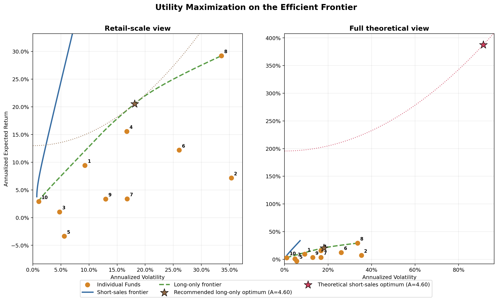
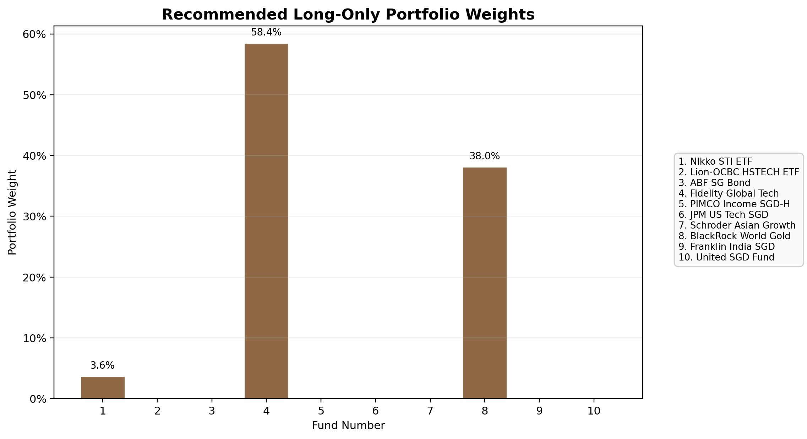

# Part 2: Risk Aversion & Optimal Portfolio

## Scope

This Part 2 analysis is built on the same 10 fund CSV files used in Part 1, with no change in the data window or return frequency.

- Fund universe: the same 10 funds from Part 1
- Common sample window: `2022-03` to `2026-03`
- Price observations in common window: `49`
- Monthly return observations: `48`
- Portfolio inputs: annualized expected returns and annualized covariance estimated from monthly returns

This keeps Part 2 fully consistent with the Efficient Frontier analysis in Part 1.

## Utility Framework

The investor utility function is:

`U = r - (A * sigma^2) / 2`

Where:

- `r` is the portfolio expected return
- `sigma^2` is the portfolio variance
- `A` is the investor's risk aversion coefficient

Interpretation:

- A larger `A` means the investor penalizes variance more heavily and will prefer lower-volatility portfolios.
- A smaller `A` means the investor is more willing to accept volatility for higher expected return.

For the portfolio optimization, I maximize:

`U(w) = w' * mu - (A / 2) * w' * Sigma * w`

subject to:

- `sum(w_i) = 1`
- Long-only recommendation: `0 <= w_i <= 1`

I also compute a short-sales-allowed benchmark, but that benchmark is not recommended for a retail robo-adviser because it can imply large leverage and operational complexity.

## Risk Assessment Questionnaire

### Design logic

The questionnaire is designed around eight dimensions:

1. Investment horizon
2. Financial resilience
3. Liquidity need
4. Loss tolerance
5. Behaviour under market stress
6. Investment objective
7. Investment experience
8. Balance sheet strength

Each question is scored from `1` to `5`, where higher scores mean higher risk tolerance. The two most behaviorally important items are weighted more heavily:

- Loss tolerance: weight `2`
- Behaviour under stress: weight `2`
- All other questions: weight `1`

This makes the questionnaire stronger than a flat checklist because the mapping to `A` puts more emphasis on the investor's actual tolerance for drawdown and likely decision-making during market stress.

### Questionnaire table

| Dimension | Weight | High-risk-tolerance direction |
| --- | ---: | --- |
| Investment horizon | 1 | Longer holding period |
| Financial resilience | 1 | More stable income and larger emergency fund |
| Liquidity need | 1 | Lower need to withdraw soon |
| Loss tolerance | 2 | Can tolerate larger one-year loss |
| Behaviour under stress | 2 | Holds or rebalances instead of panic selling |
| Investment objective | 1 | Stronger preference for growth |
| Investment experience | 1 | More experience with funds and volatility |
| Balance sheet strength | 1 | Lower debt and stronger flexibility |

The full question text and answer options are saved in:

- [`outputs/questionnaire_definition.csv`](outputs/questionnaire_definition.csv)
- [`outputs/questionnaire_definition.json`](outputs/questionnaire_definition.json)

## Mathematical Link from Questionnaire to Risk Aversion `A`

Let:

- `s_i` = answer score for question `i`, where `s_i` is between `1` and `5`
- `w_i` = weight for question `i`

Weighted questionnaire score:

`S = sum(w_i * s_i)`

For this questionnaire:

- Minimum possible score: `10`
- Maximum possible score: `50`

Risk tolerance index:

`T = (S - 10) / (50 - 10)`

Risk aversion mapping:

`A = 10 - 9T`

Equivalent linear form:

`A = 12.25 - 0.225S`

Interpretation:

- `S = 10` gives `A = 10`, which is highly risk averse
- `S = 50` gives `A = 1`, which is highly risk tolerant

## Example Investor and Calculated Risk Aversion

Because no live investor answers were supplied, I use one explicit example investor profile to produce a complete Part 2 recommendation.

### Example investor answers

| Dimension | Weight | Chosen score | Weighted contribution |
| --- | ---: | ---: | ---: |
| Investment horizon | 1 | 4 | 4 |
| Financial resilience | 1 | 4 | 4 |
| Liquidity need | 1 | 3 | 3 |
| Loss tolerance | 2 | 3 | 6 |
| Behaviour under stress | 2 | 3 | 6 |
| Investment objective | 1 | 4 | 4 |
| Investment experience | 1 | 3 | 3 |
| Balance sheet strength | 1 | 4 | 4 |
| **Total** |  |  | **34** |

From the formula:

- Weighted score: `S = 34`
- Risk tolerance index: `T = (34 - 10) / 40 = 0.60`
- Risk aversion: `A = 10 - 9(0.60) = 4.60`

Investor profile classification:

- `A = 4.60`
- Profile label: `Moderate Growth`

The detailed answer breakdown is saved in:

- [`outputs/example_investor_questionnaire_breakdown.csv`](outputs/example_investor_questionnaire_breakdown.csv)

## Optimization Result

### Recommended implementation: long-only optimal portfolio

The recommended portfolio is the long-only utility-maximizing solution for `A = 4.60`.

Portfolio statistics:

- Expected annual return: `20.53%`
- Annualized volatility: `18.11%`
- Annualized variance: `3.28%`
- Utility: `0.1299`

Recommended weights:

| Fund No. | Fund | Weight |
| --- | --- | ---: |
| 1 | Nikko STI ETF | 3.57% |
| 4 | Fidelity Global Tech | 58.39% |
| 8 | BlackRock World Gold | 38.04% |
| All other funds | 0.00% |

Why this portfolio is optimal for `A = 4.60`:

- Fund 4 and Fund 8 have the strongest expected-return contribution in the sample.
- Fund 1 helps slightly diversify the technology and gold exposure.
- More conservative assets such as Fund 10 are not included because, at `A = 4.60`, the investor still accepts meaningful risk in exchange for materially higher expected return.

### Theoretical benchmark: short-sales-allowed optimum

If short sales are allowed without additional leverage limits, the utility function produces a much more aggressive mathematical optimum:

- Expected annual return: `387.68%`
- Annualized volatility: `91.37%`
- Utility: `1.9568`

However, this benchmark is not suitable as a robo-adviser recommendation because it requires extreme long-short positions, including:

- `+1822.37%` in United SGD Fund
- `+1402.30%` in Fidelity Global Tech
- `-3344.74%` in PIMCO Income SGD-H

This is why the report recommends the long-only optimum for implementation.

## Interpretation by Risk Aversion

The optimal long-only portfolio becomes more conservative as `A` rises:

| Risk aversion `A` | Profile | Expected return | Volatility | Utility |
| ---: | --- | ---: | ---: | ---: |
| 2.00 | Aggressive Growth | 25.55% | 26.06% | 0.1875 |
| 4.00 | Moderate Growth | 21.39% | 19.16% | 0.1404 |
| 4.60 | Moderate Growth | 20.53% | 18.11% | 0.1299 |
| 6.00 | Moderately Conservative | 17.86% | 15.02% | 0.1110 |
| 8.00 | Conservative | 15.67% | 12.72% | 0.0920 |
| 10.00 | Conservative | 13.42% | 10.57% | 0.0783 |

This monotonic pattern is exactly what the utility framework should produce:

- higher `A` lowers the chosen portfolio risk
- higher `A` also lowers the expected return

## Visualizations

### Utility and efficient frontier

This figure uses two panels:

- Left: a retail-scale view showing the recommended long-only optimum clearly
- Right: the full theoretical view including the extreme short-sales benchmark

### Recommended long-only weights

### Risk aversion sensitivity

## Deliverables in `part2`

### Main files

- [`part2_risk_aversion_optimal_portfolio.py`](part2_risk_aversion_optimal_portfolio.py)
- [`part2_risk_aversion_report.md`](part2_risk_aversion_report.md)
- [`RiskAversionInteractive.jsx`](RiskAversionInteractive.jsx)

### Generated outputs

- [`outputs/part2_risk_profile_data.json`](outputs/part2_risk_profile_data.json)
- [`outputs/optimal_portfolios_long_only_summary.csv`](outputs/optimal_portfolios_long_only_summary.csv)
- [`outputs/optimal_portfolios_short_sales_summary.csv`](outputs/optimal_portfolios_short_sales_summary.csv)
- [`outputs/optimal_portfolios_long_only_full.json`](outputs/optimal_portfolios_long_only_full.json)
- [`outputs/optimal_portfolios_short_sales_full.json`](outputs/optimal_portfolios_short_sales_full.json)
- [`outputs/example_investor_weights_long_only.csv`](outputs/example_investor_weights_long_only.csv)
- [`outputs/example_investor_weights_short_sales.csv`](outputs/example_investor_weights_short_sales.csv)
- [`outputs/example_investor_weight_comparison.png`](outputs/example_investor_weight_comparison.png)
- [`outputs/recommended_long_only_weights.png`](outputs/recommended_long_only_weights.png)
- [`outputs/questionnaire_definition.csv`](outputs/questionnaire_definition.csv)
- [`outputs/questionnaire_definition.json`](outputs/questionnaire_definition.json)

## Note on the JSX Component

`RiskAversionInteractive.jsx` reads `outputs/part2_risk_profile_data.json` and provides:

- an interactive risk questionnaire
- live conversion from questionnaire score to `A`
- switching between long-only recommendation and short-sales benchmark
- a frontier chart with the selected optimal portfolio point
- dynamic display of expected return, volatility, utility, and portfolio weights

This means the JSX output remains numerically consistent with the Python optimization and the written report.
